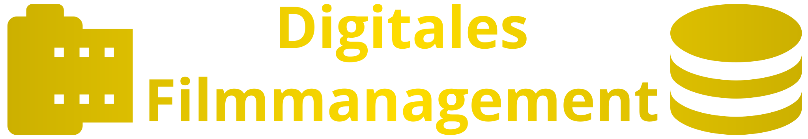

<div align="center">

<hr/>


</div>

## 📖 About
This repository contains the backend service for the digital movie management
stored in [this](https://github.com/unikino-gegenlicht/digitales-filmmanagement)
repository. The backend service is written in [Golang](http://go.dev) and
uses [`chi`](https://go-chi.io) as it's main routing component.

## 📦 Installation

To install the application, you just need Docker and Docker Compose on your
target machine.
Then you can simply download the current docker-compose.yml file and put it
in a directory of your choice.
afterward, start the docker compose stack with the following command:

```bash
docker compose build && docker compose up -d
```
The backend application will not open any ports on the host. Rather, it will be
available via the `/api` route. There will be sufficient API documentation added
as a [`openapi.yaml`](./openapi.yaml) file with return type descriptions and
HTTP Code explanations

## 💾 Data Storage

The application uses a MariaDB database to store the data. This allows the data to be stored
independently of the application and to be backed up easily.
You may use an external database.
Further information about using an external database may be found in the documentation of the
backend service.

## 📝 License
This project is licensed under the MIT License — see the [LICENSE](LICENSE) file for details.